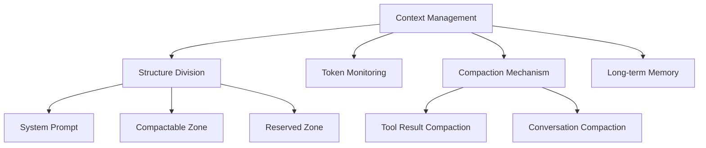
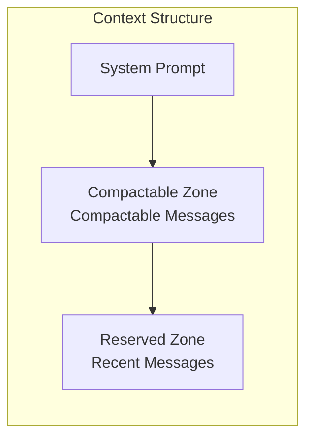
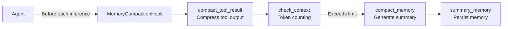
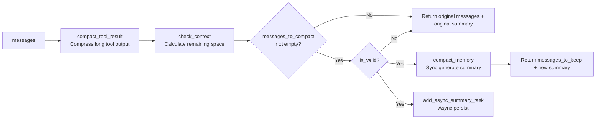
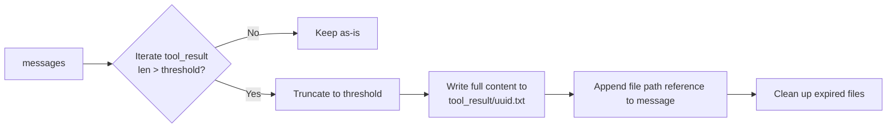
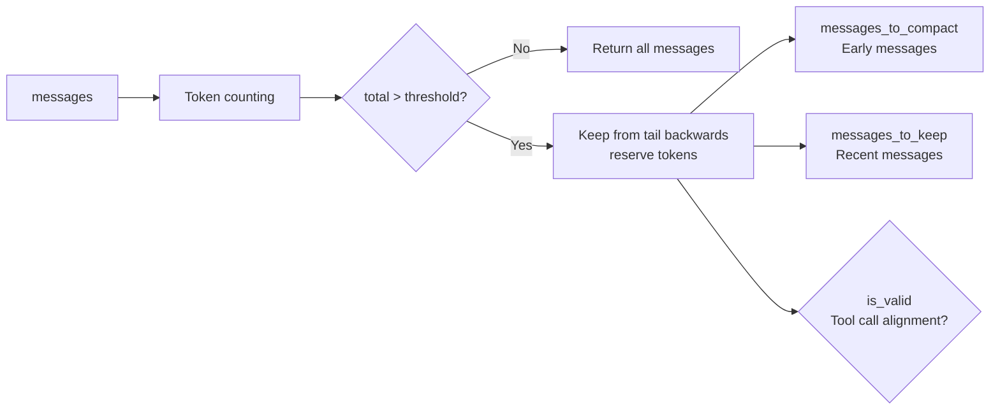
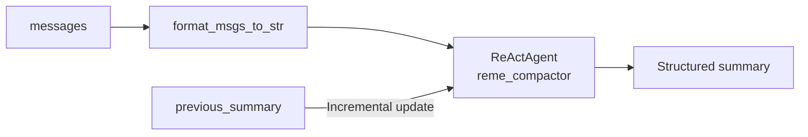
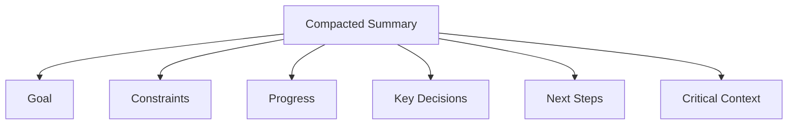

# Context Management

## Overview

Imagine the LLM's context window as a **backpack with limited capacity** 🎒. Every conversation turn, every tool call result adds something to the backpack. As the conversation goes on, the backpack gets fuller and fuller...

**Context management** is a set of mechanisms that help you "manage your backpack", ensuring the AI can work continuously and efficiently.



> The context management mechanism is inspired by [OpenClaw](https://github.com/openclaw/openclaw) and implemented by [ReMe](https://github.com/agentscope-ai/ReMe). CoPaw implements long-term memory and context management by inheriting from `ReMeLight`.

## Context Structure

CoPaw divides the context into three zones:



| Zone                 | Description                                      | Handling                                                      |
| -------------------- | ------------------------------------------------ | ------------------------------------------------------------- |
| **System Prompt**    | The AI's "role definition" and base instructions | Always retained, never compacted                              |
| **Compactable Zone** | Historical conversation messages                 | Token counted; compacted into summary when threshold exceeded |
| **Reserved Zone**    | Most recent N messages                           | Kept as-is, ensuring context continuity                       |

### Structure Example

```
┌─────────────────────────────────────────┐
│ System Prompt (Fixed)                    │  ← Always retained
│ "You are an AI assistant..."             │
├─────────────────────────────────────────┤
│ Compacted Summary (Optional)             │  ← Generated after compaction
│ "Previously helped user complete login..."│
├─────────────────────────────────────────┤
│ Compactable Zone                         │  ← Compacted when exceeded
│ [Message 1] User: Help me build login    │
│ [Message 2] Assistant: Sure, I'll...     │
│ [Message 3] Tool call result...          │
│ ...                                      │
├─────────────────────────────────────────┤
│ Reserved Zone                            │  ← Always retained
│ [Message N-2] User: Add registration     │
│ [Message N-1] Assistant: Sure...         │
│ [Message N] User: Done!                  │
└─────────────────────────────────────────┘
```

## Management Mechanism

### Architecture Overview



### Related Code

- [MemoryCompactionHook](https://github.com/agentscope-ai/CoPaw/blob/main/src/copaw/agents/hooks/memory_compaction.py)
- [compact_tool_result](https://github.com/agentscope-ai/ReMe/blob/v0.3.0.6b2/reme/memory/file_based/components/tool_result_compactor.py)
- [check_context](https://github.com/agentscope-ai/ReMe/blob/v0.3.0.6b2/reme/memory/file_based/components/context_checker.py)
- [compact_memory](https://github.com/agentscope-ai/ReMe/blob/v0.3.0.6b2/reme/memory/file_based/components/compactor.py)

### Execution Flow



**Execution Order**:

1. `compact_tool_result` — Compress long tool outputs (if enabled)
2. `check_context` — Check if context exceeds limits
3. `compact_memory` — Generate compaction summary (synchronous)
4. `summary_memory` — Persist memory (async background)

## Compaction Mechanism

When the context approaches its limit, CoPaw automatically triggers compaction, condensing old conversations into a structured summary.

### 1. compact_tool_result — Tool Result Compaction

When `enable_tool_result_compact` is enabled, long tool outputs are automatically compressed:



- Full content is saved to the `tool_result/` directory
- Truncated content + file path reference is kept in the message
- Expired files are automatically cleaned up

### 2. check_context — Context Check

Determines if context exceeds limits based on token counting, automatically splitting messages into "to compact" and "to keep" groups.



- **Core Logic**: Reserve `memory_compact_reserve` tokens from the tail backwards, marking excess as to-be-compacted
- **Integrity Guarantee**: Does not split user-assistant conversation pairs or tool_use/tool_result pairs

### 3. compact_memory — Conversation Compaction

Uses ReActAgent to compress historical conversations into a **structured context summary**:



### 4. Manual Compaction (/compact Command)

Proactively trigger compaction:

```
/compact
```

After execution, you'll see:

```
**Compact Complete!**

- Messages compacted: 12
**Compressed Summary:**
<compacted summary content>
- Summary task started in background
```

Response breakdown:

- 📊 **Messages compacted** - How many messages were compacted
- 📝 **Compressed Summary** - The generated summary content
- ⏳ **Summary task** - A background task also starts to store the summary into long-term memory

## Compaction Summary Structure

The compacted summary is a **structured context summary**, containing all the key information needed to continue working:



| Field                | Content                                 | Example                                        |
| -------------------- | --------------------------------------- | ---------------------------------------------- |
| **Goal**             | What the user wants to accomplish       | "Build a user login system"                    |
| **Constraints**      | Requirements and preferences            | "Use TypeScript, no frameworks"                |
| **Progress**         | Completed / in-progress / blocked tasks | "Login API done, registration API in progress" |
| **Key Decisions**    | Decisions made and their rationale      | "Chose JWT over Sessions for statelessness"    |
| **Next Steps**       | What to do next                         | "Implement password reset feature"             |
| **Critical Context** | Data needed to continue work            | "Main file is at src/auth.ts"                  |

- **Incremental Update**: When `previous_summary` is provided, new conversations are automatically merged with the old summary
- **Information Preservation**: Compaction preserves exact file paths, function names, and error messages, ensuring seamless context transitions

## Configuration

Configuration is located in `~/.copaw/config.json` under `agents.running`:

| Context Management Parameter | Default  | Description                                                                                    |
| ---------------------------- | -------- | ---------------------------------------------------------------------------------------------- |
| `max_input_length`           | `131072` | Model context window size (tokens), i.e., "backpack capacity"                                  |
| `memory_compact_ratio`       | `0.75`   | Threshold ratio for triggering compaction, triggers when `max_input_length * ratio` is reached |
| `memory_reserve_ratio`       | `0.1`    | Ratio of recent messages to keep during compaction, keeps `max_input_length * ratio` tokens    |

| Tool Compaction Parameter    | Default | Description                                              |
| ---------------------------- | ------- | -------------------------------------------------------- |
| `enable_tool_result_compact` | `false` | Whether to compress long tool outputs                    |
| `tool_result_compact_keep_n` | `5`     | Number of recent N tool results to keep when compressing |

**Calculation Relationships:**

- `memory_compact_threshold` = `max_input_length * memory_compact_ratio` (threshold for triggering compaction)
- `memory_compact_reserve` = `max_input_length * memory_reserve_ratio` (tokens of recent messages to keep)

**Example Configuration:**

```json
{
  "agents": {
    "running": {
      "max_input_length": 128000,
      "memory_compact_ratio": 0.7,
      "memory_reserve_ratio": 0.1,
      "enable_tool_result_compact": true,
      "tool_result_compact_keep_n": 3
    }
  }
}
```
