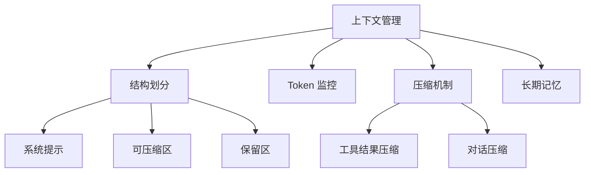
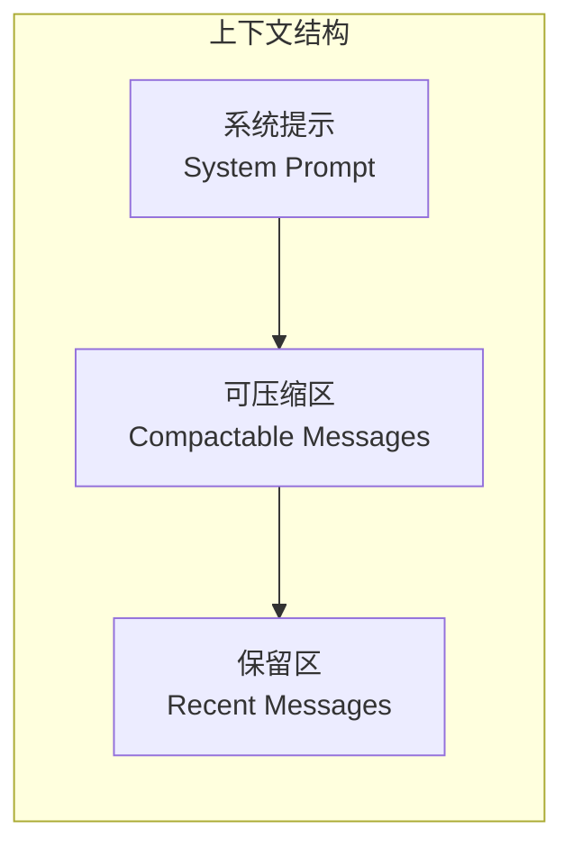
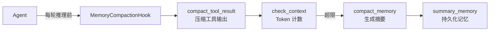
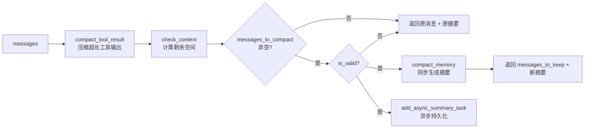
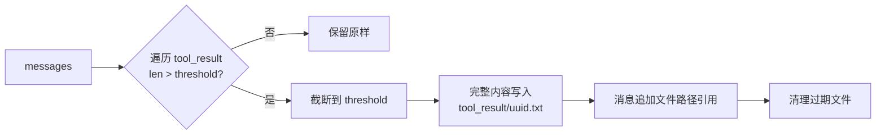
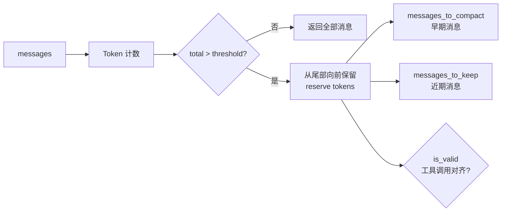
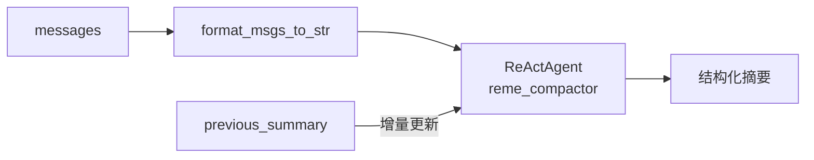
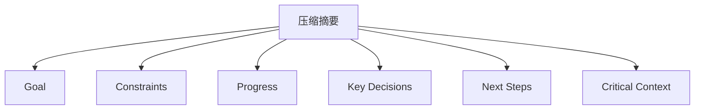

# 上下文管理（Context Management）

## 概述

LLM 的上下文窗口就像一个**有限容量的背包** 🎒。每次对话、每个工具调用的结果都会往背包里放东西。随着对话进行，背包越来越满...

**上下文管理**就是一套帮你"管理背包"的机制，确保 AI 能够持续、高效地工作。



> 上下文管理机制设计受 [OpenClaw](https://github.com/openclaw/openclaw) 启发，并由 [ReMe](https://github.com/agentscope-ai/ReMe) 实现。CoPaw 通过继承 `ReMeLight` 实现了长期记忆和上下文的管理。

## 上下文结构

CoPaw 将上下文划分为三个区域：



| 区域         | 说明                      | 处理方式                     |
| ------------ | ------------------------- | ---------------------------- |
| **系统提示** | AI 的"角色设定"和基础指令 | 始终保留，永不压缩           |
| **可压缩区** | 历史对话消息              | Token 计数，超限时压缩为摘要 |
| **保留区**   | 最近 N 条消息             | 保持原样，确保上下文连贯     |

### 结构示例

```
┌─────────────────────────────────────────┐
│ System Prompt (固定)                     │  ← 始终保留
│ "你是一个 AI 助手..."                     │
├─────────────────────────────────────────┤
│ 压缩摘要 (可选)                           │  ← 压缩后生成
│ "之前帮用户完成了登录功能..."              │
├─────────────────────────────────────────┤
│ 可压缩区                                 │  ← 超限时会被压缩
│ [消息1] 用户: 帮我写个登录功能             │
│ [消息2] 助手: 好的，我来实现...            │
│ [消息3] 工具调用结果...                   │
│ ...                                      │
├─────────────────────────────────────────┤
│ 保留区                                   │  ← 始终保留
│ [消息N-2] 用户: 再加个注册功能             │
│ [消息N-1] 助手: 好的...                   │
│ [消息N] 用户: 完成！                      │
└─────────────────────────────────────────┘
```

## 管理机制

### 架构概览



### 相关代码

- [MemoryCompactionHook](https://github.com/agentscope-ai/CoPaw/blob/main/src/copaw/agents/hooks/memory_compaction.py)
- [compact_tool_result](https://github.com/agentscope-ai/ReMe/blob/v0.3.0.6b2/reme/memory/file_based/components/tool_result_compactor.py)
- [check_context](https://github.com/agentscope-ai/ReMe/blob/v0.3.0.6b2/reme/memory/file_based/components/context_checker.py)
- [compact_memory](https://github.com/agentscope-ai/ReMe/blob/v0.3.0.6b2/reme/memory/file_based/components/compactor.py)

### 执行流程



**执行顺序**：

1. `compact_tool_result` — 压缩超长工具输出（如果启用）
2. `check_context` — 检查上下文是否超限
3. `compact_memory` — 生成压缩摘要（同步）
4. `summary_memory` — 持久化记忆（异步后台）

## 压缩机制

当上下文接近限制时，CoPaw 会自动触发压缩，将旧对话浓缩为结构化摘要。

### 1. compact_tool_result — 工具结果压缩

当 `enable_tool_result_compact` 开启时，自动压缩超长的工具输出：



- 完整内容保存到 `tool_result/` 目录
- 消息中保留截断内容 + 文件路径引用
- 过期文件自动清理

### 2. check_context — 上下文检查

基于 Token 计数判断上下文是否超限，自动拆分为「待压缩」和「保留」两组消息。



- **核心逻辑**：从尾部向前保留 `memory_compact_reserve` tokens，超出部分标记为待压缩
- **完整性保证**：不拆分 user-assistant 对话对，不拆分 tool_use/tool_result 配对

### 3. compact_memory — 对话压缩

使用 ReActAgent 将历史对话压缩为**结构化上下文摘要**：



### 4. 手动压缩（/compact 命令）

主动触发压缩：

```
/compact
```

执行后返回：

```
**Compact Complete!**

- Messages compacted: 12
**Compressed Summary:**
<压缩摘要内容>
- Summary task started in background
```

返回内容说明：

- 📊 **Messages compacted** - 压缩了多少条消息
- 📝 **Compressed Summary** - 生成的摘要内容
- ⏳ **Summary task** - 后台还会启动一个任务将摘要存入长期记忆

## 压缩摘要结构

压缩生成的摘要是一份**结构化上下文摘要**，包含继续工作所需的关键信息：



| 字段                 | 内容                   | 举例                                    |
| -------------------- | ---------------------- | --------------------------------------- |
| **Goal**             | 用户目标               | "构建一个用户登录系统"                  |
| **Constraints**      | 约束和偏好             | "使用 TypeScript，不要用任何框架"       |
| **Progress**         | 完成/进行中/阻塞的任务 | "登录接口已完成，注册接口进行中"        |
| **Key Decisions**    | 关键决策及原因         | "选择 JWT 而非 Session，因为需要无状态" |
| **Next Steps**       | 接下来要做什么         | "实现密码重置功能"                      |
| **Critical Context** | 继续工作所需的数据     | "主文件在 src/auth.ts"                  |

- **增量更新**：传入 `previous_summary` 时，自动将新对话与旧摘要合并
- **信息保留**：压缩会保留确切的文件路径、函数名称和错误消息，确保上下文无缝衔接

## 配置

配置文件位于 `~/.copaw/config.json` 中的 `agents.running` 部分：

| 上下文管理参数         | 默认值   | 说明                                                             |
| ---------------------- | -------- | ---------------------------------------------------------------- |
| `max_input_length`     | `131072` | 模型上下文窗口大小（tokens），即"背包容量"                       |
| `memory_compact_ratio` | `0.75`   | 触发压缩的阈值比例，达到 `max_input_length * ratio` 时压缩       |
| `memory_reserve_ratio` | `0.1`    | 压缩时保留的最近消息比例，保留 `max_input_length * ratio` tokens |

| 工具压缩参数                 | 默认值  | 说明                          |
| ---------------------------- | ------- | ----------------------------- |
| `enable_tool_result_compact` | `false` | 是否压缩超长工具输出          |
| `tool_result_compact_keep_n` | `5`     | 压缩工具结果时保留的最近 N 条 |

**计算关系：**

- `memory_compact_threshold` = `max_input_length * memory_compact_ratio`（触发压缩的阈值）
- `memory_compact_reserve` = `max_input_length * memory_reserve_ratio`（保留的最近消息 tokens）

**示例配置：**

```json
{
  "agents": {
    "running": {
      "max_input_length": 128000,
      "memory_compact_ratio": 0.7,
      "memory_reserve_ratio": 0.1,
      "enable_tool_result_compact": true,
      "tool_result_compact_keep_n": 3
    }
  }
}
```
