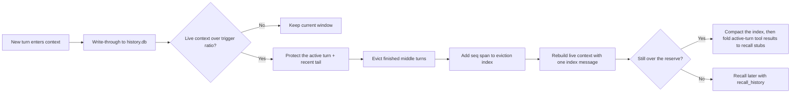

# Context Management

## Overview

QwenPaw's default context strategy is **scroll**: older turns are not summarized and discarded. They are written to a durable SQLite history store, evicted from the live model window when needed, and represented by a compact in-context index that can be expanded on demand.

The old AgentScope-native compression path is still available with `strategy: "native"`, but new configurations default to `strategy: "scroll"`.

## The Three Memory Systems

QwenPaw organizes memory into three complementary systems, loosely mirroring human memory, each owned by a different subsystem:

| System              | What it is                                                                                                                               | Documented in                   |
| ------------------- | ---------------------------------------------------------------------------------------------------------------------------------------- | ------------------------------- |
| **Working memory**  | The live prompt window. Older turns evict into a compact, expandable index — never summarized.                                           | [Context Management](./context) |
| **Episodic memory** | A durable, verbatim record of every turn across sessions, recalled on demand via `recall_history` (or the `recall_history_python` REPL). | [Context Management](./context) |
| **Semantic memory** | Distilled facts, preferences, and knowledge; ReMe consolidates daily notes into `digest/`, searched by `memory_search`.                  | [Long-term Memory](./memory)    |

Two of these — **working** and **episodic** memory — are implemented by the **scroll** context manager (`ScrollContextManager`). The third — **semantic** memory — is implemented by **ReMe**. They are deliberately orthogonal: scroll keeps raw history verbatim and never summarizes, while ReMe distills reusable knowledge and never touches the live window or the verbatim history store.

> **This page covers working and episodic memory** — the scroll context manager. For semantic memory (the ReMe long-term backend), follow the links above.

## How Scroll Works



Key properties:

- **Durable first**: `ScrollContextManager` persists live turns to `{working_dir}/history.db` before any eviction.
- **Active turn protected**: the latest user request and its in-progress tool chain are never evicted mid-task, so a compression that fires in the middle of a long tool run cannot make the model lose (and answer past) the current request.
- **No summary bottleneck**: evicted content is represented by an `EvictionIndex`, not by a generated summary.
- **Recallable raw history**: each index line carries a `seq` span. The agent can call `recall_history(op="expand", lo, hi)` to read the full original rows (or `ms.expand(lo, hi)` in the `recall_history_python` REPL).
- **Cross-session memory**: history rows include `session_id` and `agent_id`, so recall can search this agent's past sessions and, when explicitly widened, other agents in the same workspace.
- **Fallback-safe**: if scroll cannot be wired or its recall tools cannot run safely, QwenPaw falls back to native context management instead of evicting history that cannot be recalled.

## Storage Layout

| Path                                    | Default                                         | Purpose                                                                           |
| --------------------------------------- | ----------------------------------------------- | --------------------------------------------------------------------------------- |
| `{working_dir}/history.db`              | `scroll_config.db_filename = "history.db"`      | Main durable SQLite store. This is the source of truth for scroll recall.         |
| `{working_dir}/dialog/YYYY-MM-DD.jsonl` | opt-in                                          | Legacy JSONL archive of evicted turns when `scroll_config.offload_dialog = true`. |
| `{working_dir}/tool_results/`           | `tool_result_pruning_config.tool_results_cache` | File cache used by the legacy tiered tool-result pruning middleware.              |

`history.db` contains a `conversation_history` table with structured rows:

| Column                                          | Meaning                                                                     |
| ----------------------------------------------- | --------------------------------------------------------------------------- |
| `seq`                                           | Global autoincrement address used by the eviction index and recall helpers. |
| `session_id`, `agent_id`                        | Conversation and agent lineage.                                             |
| `kind`                                          | `model_turn`, `context_msg`, or `tool_result`.                              |
| `role`, `name`, `content`                       | Role/tool metadata and flattened searchable text.                           |
| `tool_call_id`, `tool_input`, `tool_state`      | Tool-call linkage and arguments/results state.                              |
| `headline`                                      | Optional model-written milestone line used as an eviction-index leaf.       |
| `blocks`, `metadata`, `created_at`, `dedup_key` | Full serialized blocks, metadata, timestamp, and idempotency key.           |

If SQLite FTS5 is available, QwenPaw also keeps a `conversation_history_fts` index over `content`. Without FTS5, recall search degrades to a slower `LIKE` scan.

## Working Memory

**Working memory** is the live prompt window — what the model can attend to right now. When it fills, scroll keeps it within budget by evicting older turns into a compact, expandable index instead of summarizing them away. Each entry in that index is a one-line **headline** the model wrote on the turn it came from. The sections below cover those headlines first, then how the live window is rebuilt, and how the eviction index is structured.

### Headlines

Scroll's defining choice is that it **does not compress context by asking the model to summarize**. Instead, the model marks its own milestones: at the end of a turn that matters — one that settles a fact or value, makes or revises a decision, reaches a result, completes a step, or hits a dead-end — it writes a single milestone line, as a trailing HTML comment wrapped in a pair of **rare bracket characters, ` … `**:

```text
<!--  chose PostgreSQL over MySQL for JSONB support  -->
```

- **How it's captured**: scroll pulls that line into the turn's `headline` column (assistant turns only) and removes the comment from what's rendered to chat — so it stays invisible to the user but verbatim in the stored row.
- **What it's for**: the headline is the key information that survives once context is compressed and the raw turn is evicted from the live window — kept in context instead of a model-written summary. That stored headline is exactly what becomes the turn's `seq ·  … ` leaf in the eviction index below.

### Live Context Layout

After eviction, the live context is rebuilt as:

```text
Eviction index (a placeholder message named "memory")
  One synthetic message scroll injects to stand in for all the evicted turns
  (not a real conversation turn). It carries the whole eviction index: a
  [context compressed] header, then tiered headlines + seq spans, plus how to
  recall the originals. Detailed in the section "Eviction Index" below.

Recent tail — always including the active turn
  The newest turns selected by AgentScope's pairing-safe split, plus the
  ACTIVE TURN: the latest real user request and everything after it, kept
  live in full even when the token-based split would have evicted it.
```

The split uses AgentScope's token accounting and pairing-safe compression helpers, so it preserves tool-call/tool-result alignment at the live-window boundary.

### Active-Turn Protection and the Pressure Pipeline

A long tool-running turn (a `/heartbeat` cron run, a multi-search task) can exceed the reserve budget by itself, and the token-based split would then evict the **current request** along with old history — leaving the model staring at an old message plus an index, and answering the wrong thing. Scroll therefore relieves pressure in three escalating stages, each engaging only if the previous one wasn't enough:

1. **Evict** — finished turns before the active turn fold into the eviction index (the normal case).
2. **Compact** — if the window still overflows the reserve, the index itself rolls up tier by tier toward a single line.
3. **Fold** — still overflowing (typically: the active turn _is_ the whole context), the active turn's completed tool results are replaced **in place** with one-line recall stubs:

   ```text
   [scroll folded] full result stored in history — re-read it with recall_history(op="expand", lo=184, hi=184)
   ```

   The request text, tool calls, reasoning, and the newest tool result stay verbatim — the turn itself remains a readable progress record, and every folded output is one `recall_history` call away (it was persisted before folding, like everything else). The stub points at the structured tool on purpose: it runs in-process without a sandbox, so the re-read works even on platforms where the Python REPL cannot run.

### Eviction Index

The eviction index is the heart of working memory: an in-context map of evicted history that keeps the live window small while staying expandable. It is tiered:

- **Tier 0** holds the most recently evicted blocks with the most detail.
- Older tiers collapse older blocks into endpoint spans.
- Every line still carries a `seq` or `seq lo-hi` span, so collapsed history remains expandable from `history.db`.

Example shape:

```text
<system-info>
[context compressed] The turns below were evicted ...

Re-expand a span with the recall_history tool: recall_history(op="expand", lo, hi)

===== Tier 1 (older msgs) =====
  [seq 10-80]
    · seq 10-34   chose SQLite history store - added recall tool 
===== Tier 0 (recently compressed) =====
  [seq 81-96]
    · seq 84   implemented context builder wiring 
    · seq 93   verified fallback to native strategy 
</system-info>
```

Each ` … ` leaf in the index is the model-written headline from the previous section. The model should not answer from a headline alone. A headline is only a pointer; the full evidence comes from `recall_history` (`expand` / `search`) or another recall helper.

## Episodic Memory

**Episodic memory** is the durable, verbatim record of everything the agent has said or done — written to `history.db` and recalled on demand, across every session. Nothing that working-memory eviction drops from the live window is lost; it stays here, exact and searchable. The sections below cover how to recall it, how oversized tool results are offloaded into it, and how older conversations are migrated into it on startup.

### Recall API

The recall API is the interface to episodic memory: it reads back the durable, verbatim history that working-memory eviction left behind. When scroll is active, QwenPaw injects two tools:

- **`recall_history`** — the structured front door for the common reads. Each call is a bound, read-only query executed in-process, so it needs no sandbox and no approval on any platform:

  ```text
  recall_history(op="expand", lo=81, hi=96)          # re-expand an indexed span
  recall_history(op="search", query="deployment decision", k=20)
  recall_history(op="recall_tool", tool_call_id="tool-call-id")
  ```

- **`recall_history_python`** — the sandboxed Python REPL for everything beyond those reads (listing sessions, custom SQL aggregation, scratch tables). The cell already defines `ms`, a `MemorySpace` object.

Common `ms` helpers in the REPL:

```python
# Re-expand an indexed span.
print(ms.expand(81, 96))

# Search this agent's durable history across sessions.
hits = ms.search("deployment decision", k=20)
for row in hits:
    print(row["seq"], row["session_id"], row["content"][:500])

# Read a specific tool call and result.
print(ms.recall_tool("tool-call-id"))

# Discover and read sessions.
print(ms.sessions())
print(ms.session("cron:nightly-report"))

# Workspace-wide discovery when explicitly needed.
print(ms.agents())
```

Recall is read-only for durable history: `history.db` is attached as SQLite schema `hist` in read-only mode. The model can write only to its scratch `main` database.

A failed cell is unmistakable: the observation leads with a `RECALL FAILED — the history was NOT read` banner, and an exit-0 cell that printed nothing says explicitly that silence is not evidence of an empty history — so an execution error can never be misread as "there is no such history".

Search (both `recall_history(op="search")` and `ms.search`) also never echoes the agent back at itself: the recall tool's own source/output rows are kept out of the results, and so is the current **active turn** (the latest user request and the reply being written) — otherwise a multi-round recall would top-k-match the previous round's quoted findings instead of the real history. Earlier evicted turns of the same session remain searchable, and `ms.expand` / `ms.recall_tool` stay unfiltered (verbatim replay is their point).

Security note: `recall_history_python` runs model-authored Python. It normally requires sandbox injection from the governance layer. (`recall_history` is unaffected: it never executes model-authored code, so it runs everywhere — including on platforms without a sandbox, such as Windows without WSL2.) If no sandbox is available, the REPL fails closed unless both are true:

- environment variable `QWENPAW_ALLOW_UNSANDBOXED_RECALL` is truthy
- `running.light_context_config.scroll_config.allow_unsandboxed = true`

Unsandboxed recall executes arbitrary host Python as the agent user and should only be used in trusted local development.

### Tool Results

There are two related mechanisms:

| Mechanism                     | Default                                                                                   | What it does                                                                                                                                                                                                                   |
| ----------------------------- | ----------------------------------------------------------------------------------------- | ------------------------------------------------------------------------------------------------------------------------------------------------------------------------------------------------------------------------------ |
| `ToolResultCapMiddleware`     | active with scroll                                                                        | If one tool result exceeds `scroll_config.tool_output_token_cap`, the full output is written to `history.db`, while the live context keeps a bounded preview and a `recall_history(op="recall_tool", tool_call_id=…)` pointer. |
| `ToolResultPruningMiddleware` | registered for every context strategy; controlled by `tool_result_pruning_config.enabled` | Legacy tiered byte pruning for tool results, with optional file cache under `tool_results/`.                                                                                                                                   |

The scroll cap is token-based and uses durable recall. The legacy pruning middleware is byte-based and keeps compatibility with the previous tool-result offload behavior. Both are active under scroll.

### Session Migration (Backfill)

Conversations that predate scroll — or any chats already stored as `sessions/*.json` in the workspace — are backfilled into `history.db` automatically, so older history stays recallable through the episodic-memory tools.

- **When**: on app startup, for every agent whose `strategy` is `"scroll"`.
- **Source**: `{working_dir}/sessions/*.json` (including channel subdirectories). The original session files are never modified or deleted.
- **One-time per file**: a `sessions/.synced.json` manifest records what was imported, so later startups skip unchanged files. Re-imports are no-ops — a `UNIQUE` index deduplicates rows.
- **Retention-aware**: messages older than `scroll_config.history_retention_days` (default `30`) are skipped during import, matching the same-boot purge that trims `history.db` to the retention window. Set `history_retention_days` to `0` to keep — and import — everything.
- **Non-blocking**: if the backfill fails, startup continues; that agent simply won't have its old chats imported, while scroll keeps recording new turns normally.

> On the first startup, a one-time notice is logged while session files are imported, since a large backlog can take a moment. Later startups have a manifest and pass straight through.

## Configuration

Relevant configuration is under `running.light_context_config`:

```json
{
  "running": {
    "light_context_config": {
      "strategy": "scroll",
      "dialog_path": "dialog",
      "context_compact_config": {
        "enabled": true,
        "compact_threshold_ratio": 0.8,
        "reserve_threshold_ratio": 0.1
      },
      "scroll_config": {
        "db_filename": "history.db",
        "tool_output_token_cap": 3000,
        "repl_timeout_s": 300,
        "history_retention_days": 30,
        "allow_unsandboxed": false,
        "offload_dialog": false
      },
      "tool_result_pruning_config": {
        "enabled": true,
        "pruning_recent_n": 2,
        "pruning_old_msg_max_bytes": 3000,
        "pruning_recent_msg_max_bytes": 50000,
        "offload_retention_days": 5,
        "tool_results_cache": "tool_results"
      }
    }
  }
}
```

Important fields:

| Field                                            | Default        | Meaning                                                                                          |
| ------------------------------------------------ | -------------- | ------------------------------------------------------------------------------------------------ |
| `strategy`                                       | `"scroll"`     | `"scroll"` uses durable history + eviction index. `"native"` uses AgentScope-native compression. |
| `context_compact_config.compact_threshold_ratio` | `0.8`          | Trigger when model input reaches this fraction of context size.                                  |
| `context_compact_config.reserve_threshold_ratio` | `0.1`          | Recent tail budget kept after eviction.                                                          |
| `scroll_config.db_filename`                      | `"history.db"` | SQLite filename relative to the workspace.                                                       |
| `scroll_config.tool_output_token_cap`            | `3000`         | Token cap for one live tool result preview.                                                      |
| `scroll_config.repl_timeout_s`                   | `300`          | Per-call timeout for `recall_history_python`.                                                    |
| `scroll_config.history_retention_days`           | `30`           | Auto-purge rows older than this many days. Set `0` to keep forever.                              |
| `scroll_config.offload_dialog`                   | `false`        | Also write legacy `dialog/*.jsonl` archive. `history.db` remains the source of truth.            |

## Manual Compaction

`/compact` still exists, but under scroll it means "force the scroll manager to reclaim live context and show the current eviction-index map", not "generate a compact summary".

Typical result:

```text
Context compressed.

===== Tier 0 (recently compressed) =====
  [seq 81-96]
    · seq 84   implemented context builder wiring 
```

If no messages are eligible or the context is already small enough, there may be no new eviction.

## Native Strategy

Set this when you want AgentScope's built-in behavior instead of scroll:

```json
{
  "running": {
    "light_context_config": {
      "strategy": "native"
    }
  }
}
```

Native mode does not wire `ScrollContextManager`, `ToolResultCapMiddleware`, or `recall_history_python`. It uses AgentScope context compression with the same `compact_threshold_ratio` and `reserve_threshold_ratio` mapping.

> **Tip:** Context configuration is typically managed through the Console (**Workspace → Running Config**) without manually editing `agent.json`.
