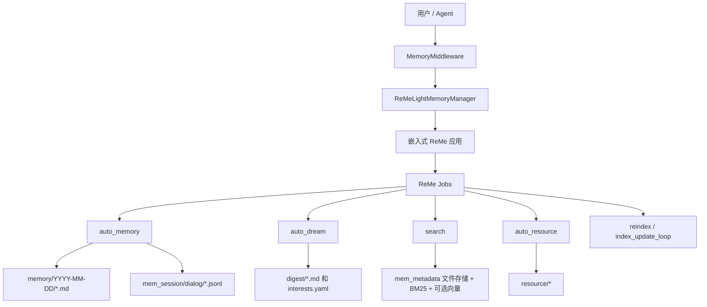
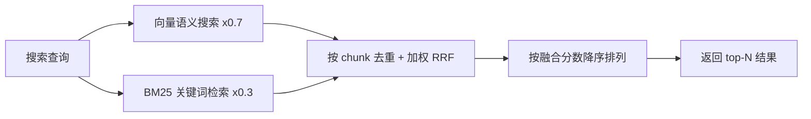

# 长期记忆

**长期记忆** 让 QwenPaw 拥有跨对话的持久记忆能力。默认后端会在 QwenPaw 进程内嵌入 ReMe 应用，并通过 ReMe jobs
完成对话事实保存、每日记忆、梦境摘要、资源文件监听和记忆检索。

> 长期记忆机制设计受 [OpenClaw](https://github.com/openclaw/openclaw)
> 启发，由 [ReMe](https://github.com/agentscope-ai/ReMe) 的 **ReMeLight** 实现——以文件系统为存储后端，记忆即 Markdown
> 文件，可直接读取、编辑与迁移。

---

## 架构概览



长期记忆管理包含以下能力：

| 能力               | 说明                                                                                    |
| ------------------ | --------------------------------------------------------------------------------------- |
| **嵌入式 ReMe**    | QwenPaw 在进程内启动 ReMe，并将当前 Agent 使用的 QwenPaw 模型注入到 ReMe 默认 LLM 组件  |
| **Auto-Memory**    | 每隔可配置数量的用户回合，将对话中值得保留的事实抽取为每日 Markdown 记忆                |
| **上下文压缩保存** | 上下文压缩前，可把尚未写入的回合先提交给同一套 `auto_memory` 流程                       |
| **Auto-Dream**     | 定时从近期每日记忆中提取更高层的 digest 单元和主动交互兴趣主题                          |
| **混合检索**       | `memory_search` 调用 ReMe `search` job，通过 BM25 + 可选向量检索，并使用 RRF 融合排序   |
| **资源记忆**       | `resource/` 下的外部文件会被编目，变更后可通过 `auto_resource` 转成带来源链接的每日记忆 |
| **Inbox 通知**     | `auto_memory`、`auto_dream`、`auto_resource` 产生结果时，会推送到 QwenPaw inbox         |

---

## 记忆文件结构

记忆以普通文件保存在 Agent 工作区中。ReMe 写出的 Markdown 是可读的记忆源数据，`mem_metadata/` 则保存搜索索引、catalog、graph
和 embedding cache 等持久状态。

```
{工作区}/
├── memory/                         ← 每日记忆
│   └── 2026-06-29/
│       ├── project-plan.md          ← auto_memory 创建或更新的单条记忆
│       └── index.md                 ← 当日记忆索引
│
├── mem_session/
│   └── dialog/
│       └── <session_id>.jsonl       ← 作为记忆来源的对话记录
│
├── digest/                         ← Auto-Dream 产出的 digest 记忆和兴趣主题
├── resource/                       ← auto_resource 监听的外部资源
└── mem_metadata/                   ← ReMe 持久化索引和 catalog
```

### memory/YYYY-MM-DD/\*.md（每日记忆）

每日记忆是 Auto-Memory 的默认输出。ReMe 每天会写入一到多条记忆，并通过来源会话来定位已有记忆，后续同一会话的新内容会更新既有
note，而不是无限创建重复文件。

- **位置**：`{working_dir}/memory/YYYY-MM-DD/*.md`
- **用途**：保存长期有用的对话事实、决策、偏好和工作记录
- **更新**：ReMe `auto_memory` 通过 `daily_write`、`read`、`edit`、`frontmatter_update`、`write` 等 ReMe 文件 jobs 创建或编辑
- **索引**：每次成功写入后，ReMe 会刷新当天的 `index.md`

### mem_session/dialog/\*.jsonl（来源对话）

抽取记忆前，ReMe 会把相关消息保存为 session log。保存时会去掉 tool result 和 base64 数据块，避免未来的 Auto-Memory
把“检索出来的旧记忆”或大媒体内容误当成用户新提供的事实。

- **位置**：默认 `{working_dir}/mem_session/dialog/<session_id>.jsonl`
- **用途**：为每日记忆提供可追溯的来源
- **链接**：每日记忆 frontmatter 会通过 `[[mem_session/dialog/<session_id>.jsonl]]` 链接回来源会话

### digest/（梦境记忆）

Auto-Dream 会读取近期每日记忆，提取可合并的 digest 单元，更新 dream catalog，并写入主动交互使用的兴趣主题。

- **位置**：`{working_dir}/digest/`
- **用途**：跨会话的高层记忆和主动交互兴趣主题
- **更新**：ReMe `auto_dream`，通常由 `dream_cron` 定时触发

### resource/（资源记忆）

`resource/` 下的文件会被监听和编目。支持的文件发生变化时，ReMe 可以通过 `auto_resource` 将其解释为带来源链接的每日记忆。

- **位置**：`{working_dir}/resource/`
- **默认支持后缀**：`md`、`txt`、`json`、`jsonl`、`csv`、`yaml`、`html`
- **日期归属**：直接放在 `resource/` 下的文件归入当天；`resource/YYYY-MM-DD/`
  下的文件归入指定日期，且可继续使用子目录
- **输出**：生成或更新 `memory/YYYY-MM-DD/<note>.md`，frontmatter 中保留
  `source_resource` 链接
- **Inbox 行为**：只有实际修改记忆时，资源处理结果才会推送到 inbox

```text
resource/report.txt                    # 归入当天
resource/2026-07-14/report.txt         # 归入 2026-07-14
resource/2026-07-14/project/data.json  # 日期目录下可使用子目录
```

> Auto Resource 当前按 UTF-8 文本读取资源。PDF、Word、Excel、图片等二进制文件不在监听后缀中，
> 不会被自动解析；请先转换为上述受支持的文本格式。`yml` 也不在默认白名单中，请使用 `yaml`。

> 关于 Auto-Memory、Auto-Dream、Auto-Memory-Search 和 Proactive
> 的完整工作流介绍，请参阅 [智能体记忆进化与主动交互](./memory-evolving-and-proactive)。以下仅补充技术实现细节与配置说明。

---

## 搜索记忆

Agent 有两种方式找回过去的记忆：

| 方式     | 工具            | 适用场景                           | 示例                                     |
| -------- | --------------- | ---------------------------------- | ---------------------------------------- |
| 混合检索 | `memory_search` | 不确定记在哪个文件，按意图模糊召回 | "之前关于部署流程的讨论"                 |
| 直接读取 | 文件工具        | 已知具体日期或文件路径，精确查阅   | 读取 `memory/2026-06-29/project-plan.md` |

### 混合检索原理

`memory_search` 会调用 ReMe 的 `search` job。搜索始终尝试 BM25 关键词检索；当配置了 embedding 模型时，也会同时运行向量检索。
两路都有结果时，ReMe 使用 **Reciprocal Rank Fusion（RRF）** 融合排序。

#### 向量语义搜索

将文本映射到高维向量空间，通过余弦相似度衡量语义距离，能捕捉意义相近但措辞不同的内容：

| 查询                   | 能召回的记忆                       | 为什么能命中                     |
| ---------------------- | ---------------------------------- | -------------------------------- |
| "项目的数据库选型"     | "最终决定用 PostgreSQL 替换 MySQL" | 语义相关：都在讨论数据库技术选择 |
| "怎么减少不必要的重建" | "配置了增量编译避免全量构建"       | 语义等价：减少重建 ≈ 增量编译    |
| "上次讨论的性能问题"   | "P99 延迟从 800ms 优化到 200ms"    | 语义关联：性能问题 ≈ 延迟优化    |

但向量搜索对**精确、高信号的 token** 表现较弱，因为嵌入模型倾向于捕捉整体语义而非单个 token 的精确匹配。

#### BM25 关键词检索

基于词频统计进行子串匹配，对精确 token 命中效果极佳，但在语义理解（同义词、改写）方面较弱。

| 查询                       | BM25 能命中            | BM25 会漏掉                    |
| -------------------------- | ---------------------- | ------------------------------ |
| `handleWebSocketReconnect` | 包含该函数名的记忆片段 | "WebSocket 断线重连的处理逻辑" |
| `ECONNREFUSED`             | 包含该错误码的日志记录 | "数据库连接被拒绝"             |

ReMe 会为被索引文件维护本地 BM25 索引。它适合命中精确标识符、错误码、文件名和低频词；即使没有配置 embedding，也能提供关键词召回。

#### 混合检索融合

当向量检索和 BM25 都返回候选时，ReMe 使用加权 RRF 融合。默认向量权重为 `0.7`，剩余 `0.3` 给关键词检索。

1. **扩大候选池**：将最终需要的结果数乘以 `candidate_multiplier`（默认 3 倍，上限 200），两路分别检索更多候选
2. **独立排序**：向量和 BM25 各自返回排序后的候选列表
3. **RRF 合并**：按 chunk id 去重，并叠加基于排名的贡献：
   - 向量贡献：`0.7 / (60 + vector_rank)`
   - 关键词贡献：`0.3 / (60 + keyword_rank)`
   - 两路都命中的 chunk 会获得两份贡献
4. **排序截断**：按 `final_score` 降序排列，返回 top-N 结果
5. **链接展开**：搜索结果可附带相关链接文件上下文，帮助理解命中片段

**示例**：查询 `"handleWebSocketReconnect 断线重连"`

| 记忆片段                                               | 向量排序 | BM25 排序 | 排名靠前原因                           |
| ------------------------------------------------------ | -------- | --------- | -------------------------------------- |
| "handleWebSocketReconnect 函数负责 WebSocket 断线重连" | 2        | 1         | 语义匹配强，同时精确命中关键词         |
| "网络断开后自动重试连接的逻辑"                         | 1        | -         | 语义匹配强，即使没有精确函数名也能召回 |
| "修复了 handleWebSocketReconnect 的空指针异常"         | -        | 2         | 精确标识符命中，使其保留在候选集中     |



> **总结**：单独使用任何一种检索方式都存在盲区。混合检索让两种信号互补，无论是「自然语言提问」还是「精确查找」，都能获得可靠的召回结果。

---

## 记忆配置

### 配置结构

记忆配置位于 `agent.json` 的 `running.reme_light_memory_config` 中：

| 配置项                          | 说明                                                                     | 默认值           |
| ------------------------------- | ------------------------------------------------------------------------ | ---------------- |
| `metadata_dir`                  | ReMe 持久状态目录，用于保存索引、catalog、graph 和缓存                   | `"mem_metadata"` |
| `session_dir`                   | 来源对话保存目录                                                         | `"mem_session"`  |
| `mem_session_dir`               | ReMe 内部 memory-agent 会话目录                                          | `"mem_agent"`    |
| `resource_dir`                  | `auto_resource` 监听的资源目录                                           | `"resource"`     |
| `daily_dir`                     | 每日记忆目录                                                             | `"memory"`       |
| `digest_dir`                    | dream/digest 记忆目录                                                    | `"digest"`       |
| `summarize_when_compact`        | 是否在上下文压缩前将待保存回合提交给 Auto-Memory                         | `true`           |
| `auto_memory_interval`          | 每隔 N 个用户回合触发 Auto-Memory。`None` 或 `<= 0` 表示禁用周期自动记忆 | `5`              |
| `dream_cron`                    | Auto-Dream 任务的 Cron 表达式（空字符串表示禁用）                        | `"0 23 * * *"`   |
| `rebuild_memory_index_on_start` | Agent 启动时是否清空并重建 ReMe 搜索索引                                 | `false`          |

### 自动记忆搜索配置

在 `running.reme_light_memory_config.auto_memory_search_config` 中配置：

启用后，搜索结果会作为已完成的 `memory_search` 交互注入当前 live context。
同一轮工具循环里的后续模型调用仍可读取这些结果，直到常规上下文管理将其驱逐。

| 配置项        | 说明                             | 默认值  |
| ------------- | -------------------------------- | ------- |
| `enabled`     | 是否在每次对话时自动执行记忆搜索 | `false` |
| `max_results` | 自动搜索时最多返回的结果数       | `2`     |

### Embedding 配置（可选）

Embedding 配置用于向量语义搜索，位于 `running.reme_light_memory_config.embedding_model_config`：

| 配置项             | 说明                                                                                  | 默认值   |
| ------------------ | ------------------------------------------------------------------------------------- | -------- |
| `backend`          | Embedding 后端类型：`openai`、`dashscope`、`dashscope_multimodal`、`gemini`、`ollama` | `openai` |
| `api_key`          | Embedding 服务的 API Key。OpenAI 兼容和 Gemini 后端必填                               | ``       |
| `base_url`         | OpenAI 兼容后端的可选自定义 API 地址；Ollama 后端会作为 host 传递                     | ``       |
| `model_name`       | Embedding 模型名称                                                                    | ``       |
| `dimensions`       | Embedding 向量维度                                                                    | `1024`   |
| `enable_cache`     | 是否启用 Embedding 缓存                                                               | `true`   |
| `use_dimensions`   | 是否在 API 请求中传递 dimensions 参数                                                 | `false`  |
| `max_cache_size`   | Embedding 缓存最大条目数                                                              | `10000`  |
| `max_input_length` | 单次 Embedding 的近似字符预算                                                         | `8192`   |
| `max_batch_size`   | Embedding 批处理最大数量                                                              | `10`     |

> `use_dimensions` 用于某些 vLLM 模型不支持 dimensions 参数的情况，设为 `false` 可跳过该参数。

从 ReMe 0.4.1.0 开始，Embedding 输入截断会为 token 密度更高的 CJK 和其他全角字符采用更保守的预算，
并预留安全余量。这可以避免较长的中文记忆在 Ollama + bge-m3 等组合下超过模型上下文窗口并返回 HTTP 400。
`max_input_length` 仍是近似字符预算，并非模型 tokenizer 计算出的严格 token 上限；如果所用模型的上下文窗口更小，
仍应相应调低该值。

向量检索只有在当前后端具备最低可运行配置时才会启用；这些条件与 AgentScope credential 要求保持一致：

| 后端                                            | 启用条件                         | Credential 映射                |
| ----------------------------------------------- | -------------------------------- | ------------------------------ |
| `openai` / `dashscope` / `dashscope_multimodal` | `model_name` 和 `api_key` 均非空 | `api_key`；可选 `base_url`     |
| `gemini`                                        | `model_name` 和 `api_key` 均非空 | `api_key`                      |
| `ollama`                                        | `model_name` 非空                | 可选 `host`（来自 `base_url`） |

### 索引行为

嵌入式 ReMe 配置使用本地 file store：

| 组件       | 行为                                                              |
| ---------- | ----------------------------------------------------------------- |
| File store | ReMe 本地文件存储，持久状态位于 `mem_metadata/`                   |
| 关键词索引 | 默认启用 BM25 关键词索引                                          |
| 向量索引   | 仅当 `embedding_model_config` 满足当前 `backend` 的启用条件时启用 |
| 监听目录   | `daily_dir` 和 `digest_dir`                                       |
| 监听后缀   | `md`                                                              |

---

## 其他 Memory Backend

QwenPaw 的记忆系统采用可插拔的 Backend 架构。除了默认的 ReMeLight（本地文件存储）外，还支持通过 `memory_manager_backend` 切换到其他后端。

### ADBPG（AnalyticDB for PostgreSQL）

基于云端向量数据库的长期记忆后端，适合需要跨设备共享、大规模语义检索的场景。QwenPaw 通过 ADBPG 记忆服务的 REST API 接入，无需安装额外数据库驱动。

**核心特点：**

- **跨会话持久化** — 记忆存储在云端数据库，重启后不丢失，支持多设备共享
- **服务端事实抽取** — 由 ADBPG 记忆服务完成事实提取，客户端无额外开销
- **REST API 接入** — 通过 HTTP API 调用 ADBPG 记忆服务
- **优雅降级** — ADBPG 不可达时 Agent 正常运行，仅长期记忆功能暂时禁用

**配置方式：**

进入 Agent 配置页面的「运行配置」标签，找到「记忆管理后端」下拉框，选择 `adbpg`，并在「ADBPG 长期记忆」Tab 中填写 `REST Base URL` 与 `REST API Key`。


> ⚠️ 切换后端不支持热更新，保存后需要重启 QwenPaw 才能生效（页面也会以黄色横幅提醒）。

> 迁移提示：ADBPG SQL 直连模式已移除。旧配置中的 `api_mode: "sql"`、
> `host`、`port`、`user`、`password`、`dbname`、LLM 和 Embedding 相关字段
> 会被忽略；请改为配置 `rest_base_url` 和 `rest_api_key`，保存后重启
> QwenPaw。

| 配置项                      | 说明                                                                    | 默认值                                |
| --------------------------- | ----------------------------------------------------------------------- | ------------------------------------- |
| `rest_base_url`             | ADBPG 记忆服务的 REST API 地址                                          | `""`                                  |
| `rest_api_key`              | REST API 的访问密钥                                                     | `""`                                  |
| `memory_isolation`          | 记忆隔离模式，`true` 为每个 Agent 独立，`false` 为共享                  | `true`                                |
| `search_timeout`            | 记忆搜索超时时间（秒）                                                  | `10.0`                                |
| `auto_memory_search_config` | 自动记忆搜索配置，结构与 ReMe Light 的 `auto_memory_search_config` 一致 | `{"enabled": true, "max_results": 3}` |

**配置示例：**

完整配置可写入 `agent.json` 的 `running.adbpg_memory_config` 字段：

```json
{
  "running": {
    "memory_manager_backend": "adbpg",
    "adbpg_memory_config": {
      "rest_base_url": "https://your-adbpg-memory-api.example.com",
      "rest_api_key": "your-rest-api-key",
      "memory_isolation": true,
      "search_timeout": 10.0,
      "auto_memory_search_config": {
        "enabled": true,
        "max_results": 3
      }
    }
  }
}
```

> 💡 通过 Console「运行配置」页面填写时，框架会自动将这些字段写入 `agent.json`，无需手动编辑文件。

---

## 相关页面

- [智能体记忆进化](./memory-evolving-and-proactive) — Auto-Memory、Auto-Dream、Auto-Memory-Search、Proactive 完整工作流
- [项目介绍](./intro) — 这个项目可以做什么
- [控制台](./console) — 在控制台管理记忆与配置
- [Skills](./skills) — 内置与自定义能力
- [配置与工作目录](./config) — 工作目录与 config
